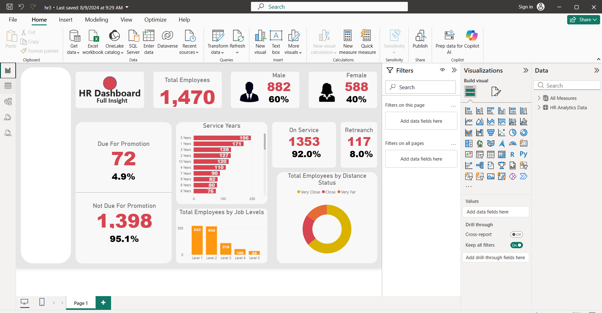
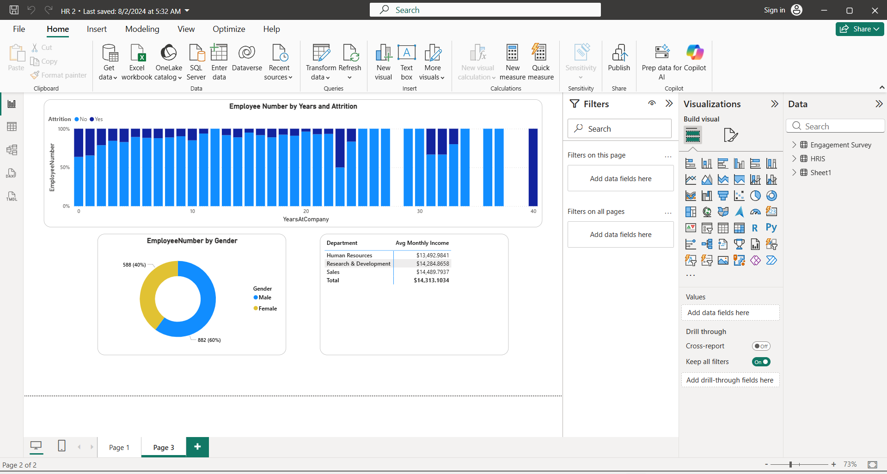
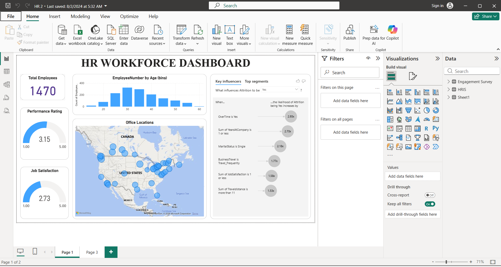

# HR Workforce Analytics Dashboard | Power BI

## Project Overview

This Power BI project provides a comprehensive analysis of workforce demographics, employee engagement, performance, and attrition patterns. The dashboard is designed to help HR teams and business leaders understand workforce trends, identify factors influencing employee turnover, and support data-driven human resource decisions.

The project combines employee records, HR information, and engagement survey data to deliver actionable insights into workforce health and organizational performance.

---

## Dashboard Preview

### HR Workforce Overview



### Employee Attrition Analysis



### Workforce Summary Dashboard



---

## Business Objectives

* Monitor workforce demographics and employee distribution.
* Analyze employee attrition trends and contributing factors.
* Track employee performance and job satisfaction levels.
* Evaluate workforce retention and promotion readiness.
* Identify patterns related to department, tenure, travel, and employee engagement.
* Support strategic HR decision-making through data-driven insights.

---

## Dataset Information

The analysis is based on HR workforce data containing employee-related information such as:

### Employee Information

* Employee Number
* Age
* Gender
* Department
* Education
* Education Field
* Job Level
* Years at Company
* Business Travel
* Distance From Home

### Workforce Metrics

* Attrition Status
* Performance Rating
* Job Satisfaction
* Environment Satisfaction
* Monthly Income
* Promotion Eligibility
* Retirement Status

### Additional Sources

* HRIS Data
* Employee Engagement Survey Data

---

## Data Preparation

Data preparation was performed using **Power Query**, including:

* Data cleaning and validation
* Handling missing values
* Data type conversions
* Workforce metric calculations
* Integration of multiple HR datasets
* Preparation of employee demographic and engagement attributes

---

## Key Performance Indicators (KPIs)

### Workforce Overview

| KPI                | Value     |
| ------------------ | --------- |
| Total Employees    | 1,470     |
| Male Employees     | 882 (60%) |
| Female Employees   | 588 (40%) |
| Performance Rating | 3.15      |
| Job Satisfaction   | 2.73      |

### Workforce Planning

| KPI                   | Value |
| --------------------- | ----- |
| Due for Promotion     | 72    |
| Not Due for Promotion | 1,398 |
| Active Employees      | 1,353 |
| Retirement Eligible   | 117   |

---

## Dashboard Features

### Workforce Demographics

* Employee distribution by age groups
* Gender distribution analysis
* Workforce geographic distribution
* Employee count by job level

### Attrition Analysis

* Attrition by years at company
* Attrition trends across employee segments
* Factors influencing employee turnover
* Key influencer analysis

### Employee Performance

* Performance rating monitoring
* Department-wise income analysis
* Employee engagement indicators
* Job satisfaction tracking

### Workforce Planning

* Promotion eligibility analysis
* Retirement planning insights
* Service year distribution
* Employee distance-to-work analysis

### Geographical Analysis

* Office location mapping
* Employee distribution across locations
* Regional workforce visibility

---

## Key Insights

* The organization employs a workforce of 1,470 employees.
* Male employees represent 60% of the workforce, while females account for 40%.
* Employees with overtime responsibilities show a significantly higher likelihood of attrition.
* Lower job satisfaction and shorter tenure are strong indicators of employee turnover.
* Most employees fall within the early-to-mid career age groups.
* A small percentage of employees are currently due for promotion, while the majority remain in active service.
* Job Level 1 and Job Level 2 contain the largest share of employees.

---

## Tools & Technologies

* Power BI Desktop
* Power Query
* DAX
* Microsoft Excel
* HR Analytics
* Data Visualization

---

## Repository Structure

```text
HR-Workforce-Analytics-Dashboard/
│
├── HR Dashboard.pbix
├── HR Analytics Data.xlsx
├── images/
│   ├── hr_overview.png
│   ├── attrition_analysis.png
│   ├── hr_summary.png
│   └── dataset.png
└── README.md
```

---

## Dataset Preview


---

## Skills Demonstrated

* HR Analytics
* Workforce Planning
* Attrition Analysis
* Employee Performance Analysis
* Data Cleaning & Transformation
* Data Modeling
* DAX Calculations
* KPI Development
* Dashboard Design
* Business Intelligence Reporting
* Data Visualization

---

## Business Value

This dashboard enables HR teams and management to:

* Understand workforce composition.
* Identify employees at risk of leaving.
* Improve retention strategies.
* Monitor employee satisfaction and engagement.
* Support promotion and succession planning.
* Make informed workforce management decisions.

---

## Author

**Hamid Nawaz**

Computer Science Student | Data Analytics Enthusiast | Power BI Developer

## Connect With Me

- LinkedIn: www.linkedin.com/in/
- Fiverr: [https://www.fiverr.com/your-username](https://www.fiverr.com/s/e6D4d4E)
- Email: hamidsherani2172@gmail.com
